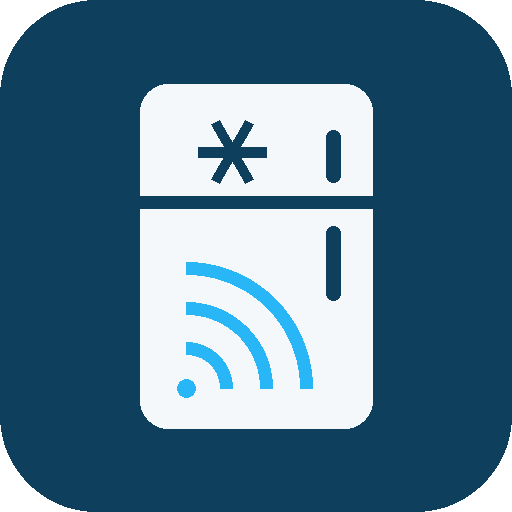

<h1 align="center">
  <br>
  liebherr2mqtt
</h1>

<p align="center">
  <b>Liebherr SmartDevice HomeAPI → MQTT bridge, with Home Assistant style discovery.</b><br>
  Brings a connected Liebherr fridge or freezer into <b>Jeedom</b>, <b>Home Assistant</b>,
  or anything else that speaks MQTT Discovery — in real time, without polling the cloud.
</p>

---

## Why

Liebherr appliances fitted with a **SmartDeviceBox** are cloud-only in practice. The box does
contain a *LocalAPI*, but Liebherr disables it remotely on consumer appliances — it is only
enabled on the SmartModule of their professional ranges. The remaining option is the official
**SmartDevice HomeAPI**, published in beta in April 2025.

Home Assistant has had a first-class integration for it since 2026.3. Jeedom has nothing.
This bridge fills that gap, and works for any MQTT-Discovery consumer.

It is built on **[`pyliebherrhomeapi`](https://pypi.org/project/pyliebherrhomeapi/)**, the library
behind Home Assistant's official `liebherr` integration, rather than on a hand-rolled HTTP client —
so it inherits that project's data model, error taxonomy and SSE reconnection logic.

## Features

- **Real-time, no polling.** State changes arrive as a push over **Server-Sent Events**
  (`/v1/sse/devices/{id}/controls`). Liebherr rate-limits the HomeAPI and has been known to block
  calling IP addresses; this bridge simply does not hammer it. A single full re-read every 15
  minutes (configurable, and disableable) acts as a safety net.
- **Auto-discovery.** Entities appear on their own in Jeedom or Home Assistant, grouped as one
  device, with proper units, ranges and icons.
- **Reconnection-proof.** Discovery, states **and command subscriptions** are replayed on *every*
  MQTT (re)connection. This is the failure mode that silently breaks a lot of home-made bridges:
  with a non-persistent session the broker drops your subscriptions on any disconnect, and a bridge
  that only subscribes at startup keeps publishing states while quietly ignoring every command.
- **Last Will.** If the container dies, the appliance's *online* indicator flips to off by itself.
- **Only what your appliance actually has.** Entities are built from the controls the device
  declares, not from a hard-coded model list.

## Supported controls

| HomeAPI control | Published as | Notes |
|---|---|---|
| `temperature` | `sensor` (measured) + `number` (setpoint) | Uses the device's own min/max. Becomes a `select` if the appliance only accepts discrete steps. |
| `supercool` | `switch` | Per zone |
| `superfrost` | `switch` | Per zone |
| `partymode` | `switch` | Whole appliance. ⚠️ Runs SuperCool/SuperFrost for 24 h |
| `nightmode` | `switch` | Whole appliance |
| `holidaymode`, `bottletimer` | `switch` | Whole appliance |
| `presentationlight` | `number` | Brightness, 0…max |
| `icemaker` | `select` | Off / On / MaxIce, MaxIce only if supported |
| `hydrobreeze` | `select` | Off / Low / Medium / High |
| `biofreshplus` | `select` | Only the modes the appliance reports as supported |
| `autodoor` | `sensor` (state) + `switch` (open) | |
| — | `binary_sensor` "online" | Connectivity, backed by the MQTT Last Will |

Multi-zone appliances get one entity per zone, suffixed with the zone position.

> ❌ **Door state and door alarms are not available.** They are not part of the HomeAPI — the
> mobile app reads them from a separate, undocumented internal API.

## Getting an API key

In the **SmartDevice** mobile app:

> Settings → *Become a beta tester* → *Activate the HomeAPI interface* → **Generate a new key**

⚠️ **The key can only be copied once.** Copy it before leaving that screen.

## Running it

### Docker

```bash
docker run -d \
  --name liebherr2mqtt \
  --restart unless-stopped \
  -e LIEBHERR_API_KEY=xxxxxxxxxxxxxxxxxxxxxxxxxxxxxxxxxxxxxxxx \
  -e MQTT_HOST=192.168.1.10 \
  -e MQTT_USER=mqttuser \
  -e MQTT_PASSWORD=mqttpassword \
  ghcr.io/ripleyxlr8/liebherr2mqtt:latest
```

### Unraid

Install it from **Community Applications** — open the *Apps* tab and search for `liebherr2mqtt`.
Every setting is a field in the UI, and the API key field is masked.

The CA template lives in
[ripleyXLR8/unraid-templates](https://github.com/ripleyXLR8/unraid-templates/blob/main/liebherr2mqtt.xml),
which is the repository Community Applications indexes.

### Configuration

Everything can be set through **environment variables**, or through a
`/config/liebherr2mqtt.conf` file (see [`liebherr2mqtt.conf.template`](liebherr2mqtt.conf.template)).
Environment variables win over the file, and the file is entirely optional.

| Variable | Default | Meaning |
|---|---|---|
| `LIEBHERR_API_KEY` | — | **Required.** HomeAPI key from the app |
| `LIEBHERR_REFRESH_INTERVAL` | `900` | Seconds between full re-reads; `0` disables |
| `MQTT_HOST` / `MQTT_PORT` | `127.0.0.1` / `1883` | Broker |
| `MQTT_USER` / `MQTT_PASSWORD` | empty | Leave empty for an anonymous broker |
| `MQTT_CLIENT_ID` | `liebherr2mqtt` | |
| `MQTT_DISCOVERY_PREFIX` | `homeassistant` | Where discovery messages go |
| `MQTT_TOPIC_PREFIX` | `liebherr` | Root of state and command topics |
| `LOG_LEVEL` | `INFO` | `DEBUG`, `INFO`, `WARNING`, `ERROR` |

## Topics

```
liebherr/<device>/availability              online | offline
liebherr/<device>/<entity>/state            current value    (retained)
liebherr/<device>/<entity>/set              command
homeassistant/<component>/liebherr_<device>/<entity>/config   discovery (retained)
```

## Jeedom notes

Install the **MQTT Discovery** plugin, point it at your broker, and the appliance shows up on its
own. Three traps worth knowing:

- The plugin only creates equipment for topic roots listed in its **data topics** setting, so
  `liebherr` has to be there. You do not have to type it: start the plugin daemon, wait a minute,
  refresh its configuration page, and the roots it has discovered but that are not configured yet
  are offered with a `+` button. This is deliberate and
  [documented](https://mips2648.github.io/jeedom-plugins-docs/MQTTDiscovery/fr_FR/#tocAnchor-1-7-2) —
  the plugin does not auto-enable everything it finds, because that would create a lot of
  equipment nobody asked for.
- The plugin **renames a command after the discovery `device_class`**, which is why the setpoint
  here deliberately carries no `device_class`: it would be created as a second command named
  "Temperature" instead of "Setpoint".
- ⚠️ **The `core::alert` widget is red on 0 and green on 1**, which is the opposite of what its
  name suggests — Jeedom defines it in `core/config/jeedom.config.php` with `#_icon_on_#` as a green
  check and `#_icon_off_#` as a red alert. This bridge follows the Home Assistant conventions:
  `device_class: connectivity` is ON while the link is **up**, and `device_class: problem` is ON
  while there **is** a problem. The plugin maps neither class, so if you put those commands on
  `core::alert`, tick **"invert binary"** by hand on the alarms and leave it **off** on the online
  indicator. Backwards, it shows a healthy appliance in red and a real alarm in green.

## Home Assistant notes

If you use Home Assistant, prefer its
**[official `liebherr` integration](https://www.home-assistant.io/integrations/liebherr/)** — it
talks to the same API directly, with no broker in between. This bridge is for everything else.

## License

MIT — see [LICENSE](LICENSE).

Not affiliated with, endorsed by, or supported by Liebherr. "Liebherr", "SmartDevice",
"BioFresh", "SuperCool" and "SuperFrost" are trademarks of their respective owners.
